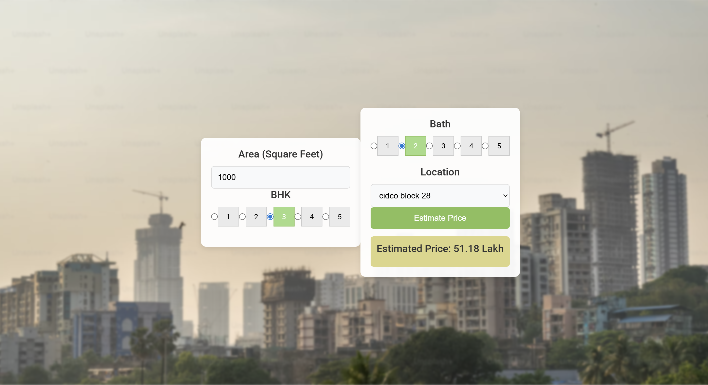

# Sambhajinagar_house_price_prediction_using_ml

# 🏡 Sambhaji Nagar House Price Prediction using ML

This project predicts house prices in Sambhaji Nagar using a machine learning model (Linear Regression).  
It uses features like area type, availability, location, size, total_sqft, BHK, bathrooms, and more to estimate the price.

---

## 📊 Tech Stack

- Python  
- Pandas, NumPy, Matplotlib  
- Scikit-learn  
- Flask (API backend)  
- Pickle (model serialization)  
- HTML, CSS, JS (Frontend)

---

## ⚙️ How It Works

1. User enters location, square feet, BHK, and bathroom count.
2. Frontend sends data to the Flask API.
3. The trained model predicts the house price and returns it.
4. The UI displays the predicted price.

---
## 🖼️ GUI Preview

